# SPEAR-BF: Wideband Multi-Channel D-Band Beamformer based on the RFSoC Platform

Welcome to the SPEAR-BF repository! This project provides complete software and hardware designs for a real-time wideband D-band beamforming testbed built on the [Xilinx RFSoC](https://www.amd.com/en/products/adaptive-socs-and-fpgas/soc/zynq-ultrascale-plus-rfsoc.html) technology and the [CHARM D-band frontend](https://ieeexplore.ieee.org/abstract/document/10873811).

SPEAR-BF (Software-defined Python-Enhanced RFSoC) enables experimental research in sub-THz spectrum, directional communications, and integrated sensing and communication (ISAC).

## Overview

SPEAR-BF bridges the gap in sub-THz spectrum research by providing a flexible, real-time, wideband experimental system. It supports:
- **Real-Time Wideband Streaming:** Up to 1.2 GHz aggregated bandwidth via custom Hardware-Assisted StreamingDMA.
- **Digital Beamforming:** Dedicated hardware IP for multi-channel phase and amplitude control.
- **Scalable Architecture:** Support for 1T1R, 4T1R, and 8T1R configurations, expandable to 16T16R.
- **Pythonic Interface:** High-level PYNQ-based API for rapid prototyping of modulation schemes and beam-steering algorithms.

## System Architecture

The core of SPEAR-BF is a DRAM-centric SDR architecture on the Xilinx RFSoC ZCU216. It utilizes high-speed system memory as the primary buffer, enabling the streaming of long-duration, continuous waveforms (up to $2^{31}$ samples).

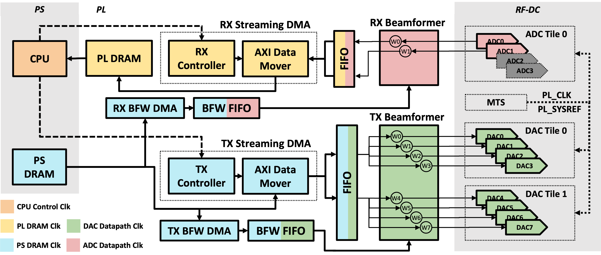

Key components include:
- **StreamingDMA IP:** A custom FSM-based DMA that ensures deterministic high-speed data transfers, overcoming the jitter of stock DMA IPs.
- **Digital Beamformer IP:** Applies complex-valued weights in the FPGA fabric with a steering speed of $\approx$ 6 ns.
- **Multi-Tile Synchronization (MTS):** Ensures phase coherence across RF-DC tiles, supplemented by a software-based calibration routine.

## Experimental Setup

The platform is integrated with the CHARM D-band module for 135 GHz operation.

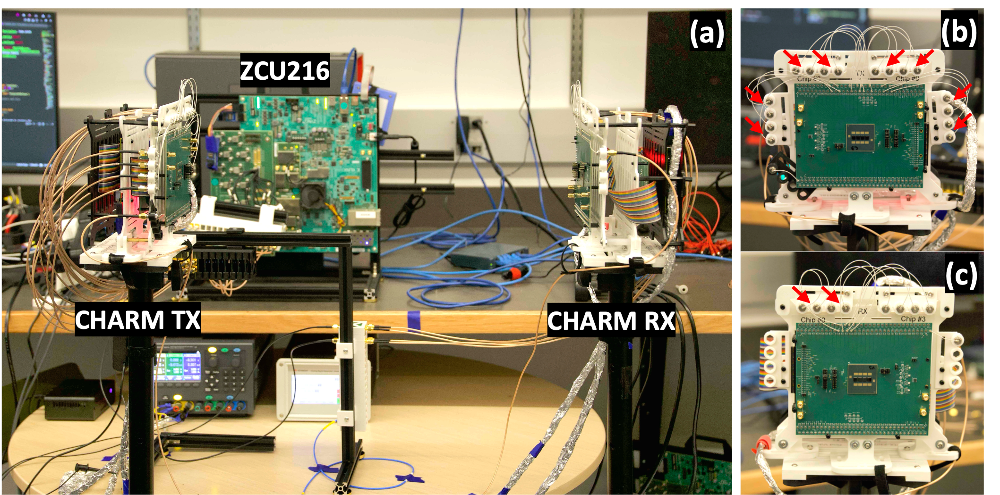

| Configuration | Setup | Carrier Frequency | Connection |
|---------------|-------|-------------------|------------|
| **C1** | 1T1R | 700 MHz | Wired Loopback |
| **C2** | 1T1R | 700 MHz | OTA (Sub-6 GHz) |
| **C3** | 1T1R | 135 GHz | CHARM OTA |
| **C4** | 4T1R | 135 GHz | CHARM OTA |
| **C5** | 8T1R | 135 GHz | CHARM OTA |

The detailed connectivity involving the RFSoC ZCU216, CHARM boards, and balun converters is shown below:

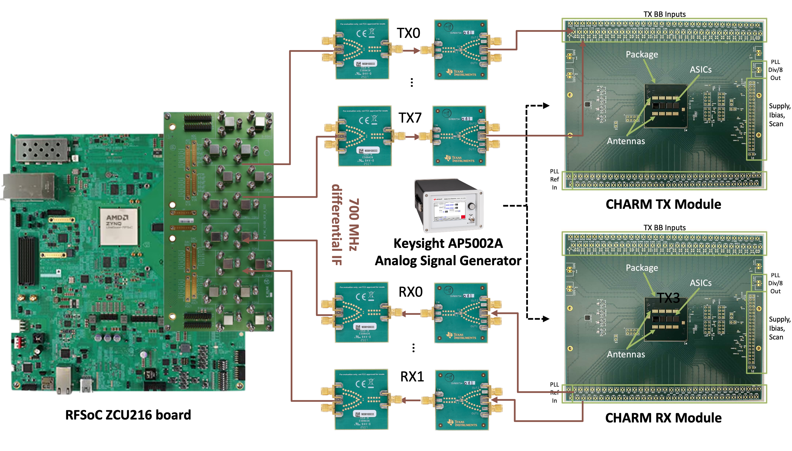

## Key Results

### 1. Physical Layer Performance
The system supports modulations from QPSK to 256-QAM. 1T1R configurations meet 3GPP EVM requirements for wideband links, while multi-channel beamforming (4T1R/8T1R) provides significant SNR gains.

<p align="center">
  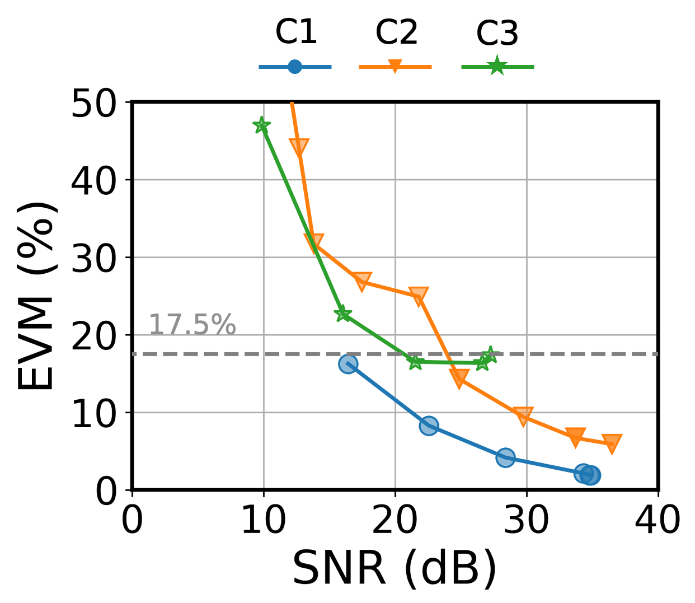
  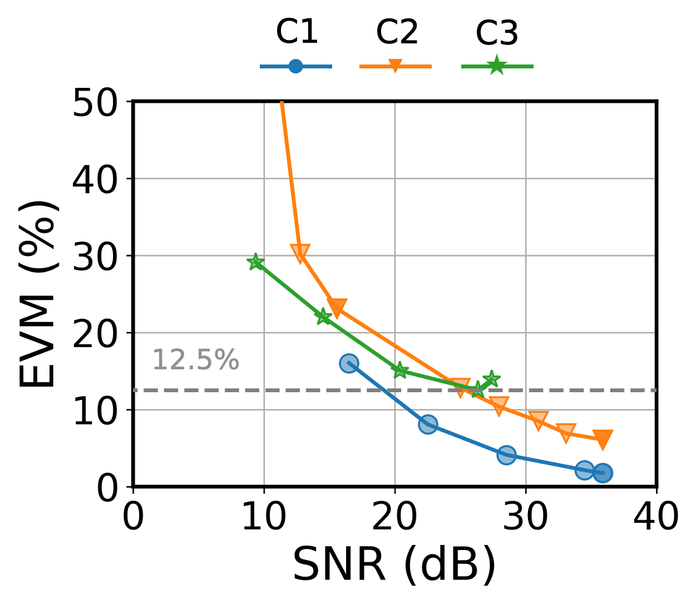
</p>

### 2. Phase Calibration
To compensate for hardware imperfections (cables, RF chains), SPEAR-BF includes a software-based calibration routine. This process aligns the phases of multiple channels for constructive interference at the receiver.

<p align="center">
  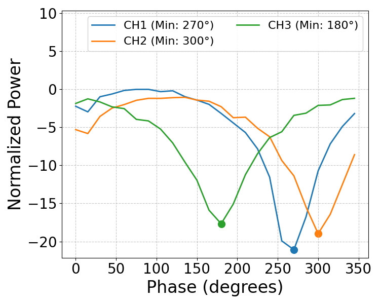
  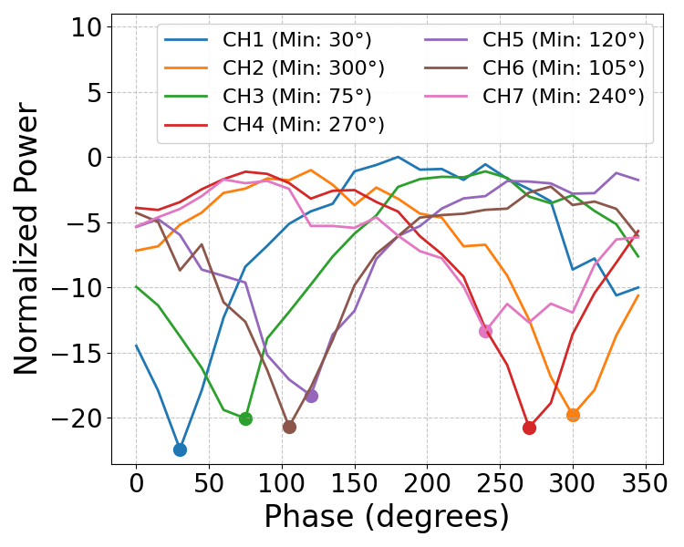
</p>

### 3. Radiation Patterns & Beam Steering
The calibrated system produces radiation patterns that closely match theoretical models. Beam steering at 135 GHz is demonstrated across $\pm 90^\circ$.

<p align="center">
  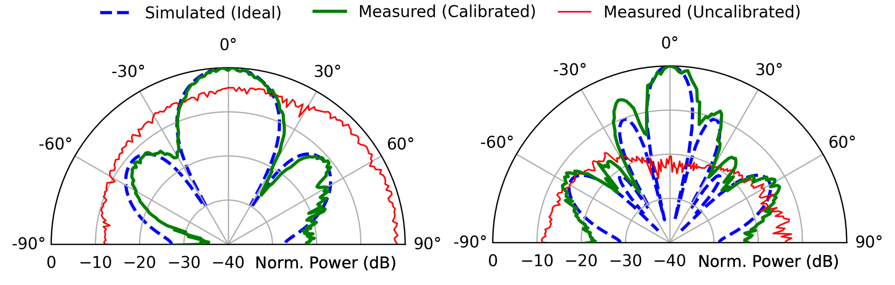
  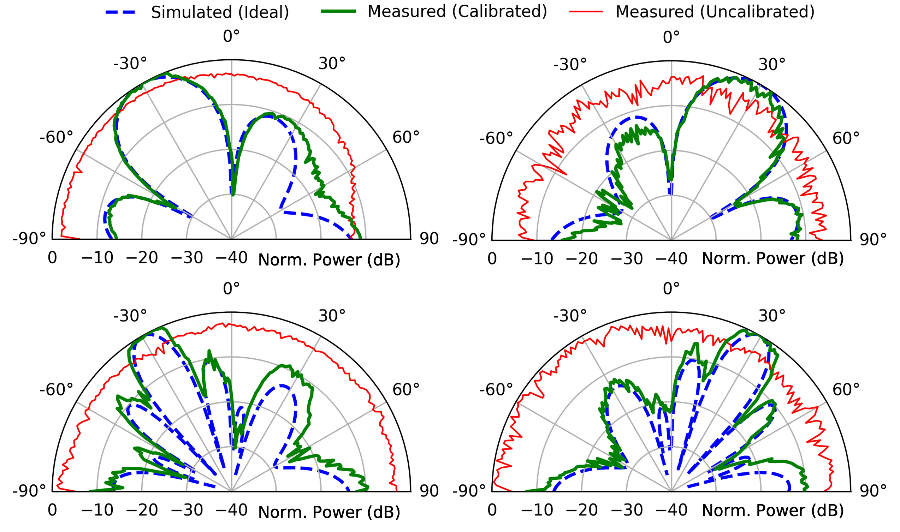
</p>

---

## Technical Instructions

### System Requirements

- Vivado 2021.1
- [PYNQ image for ZCU216](https://github.com/sarafs1926/ZCU216-PYNQ)
- Xilinx RFSoC ZCU216 board
- Valid Vivado license for ZCU216 board bitstreams

### Bitstream Preparation

1. Clone the repository:
   ```bash
   git clone git@github.com:functions-lab/SPEAR_BF.git
   ```
2. Navigate to the hardware design:
   ```bash
   cd ./SPEAR_BF/hw_design/ZCU216
   ```
3. Generate the desired configuration:
   ```bash
   # Example: 100MHz bandwidth config
   make bd DESIGN=rfsoc_rfdc_v39_100M; make bit DESIGN=rfsoc_rfdc_v39_100M;
   ```

### ZCU216 Setup

1. Boot the RFSoC with the PYNQ SD card.
2. Clone the repository on the board:
   ```bash
   git clone git@github.com:functions-lab/SPEAR_BF.git
   ```
3. Upload the generated `*.bit` and `*.hwh` files to `./SPEAR_BF/rfsoc_rfdc/bitstream/`.
4. Run the Jupyter Notebooks:
   - `rfsoc_rfdc_v47_4t1r_bf.ipynb` adn `rfsoc_rfdc_v47_8t1r_bf.ipynb` for beamforming experiments.

### Wiring Setup

Ensure proper loopback or CHARM integration as described in the [Experimental Setup](#experimental-setup) section. Detailed wiring for DAC/ADC tiles and the CLK104 board is essential for Multi-Tile Synchronization.

<p align="center">
  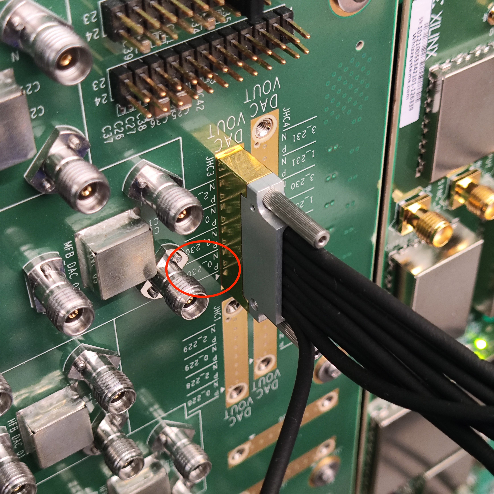
  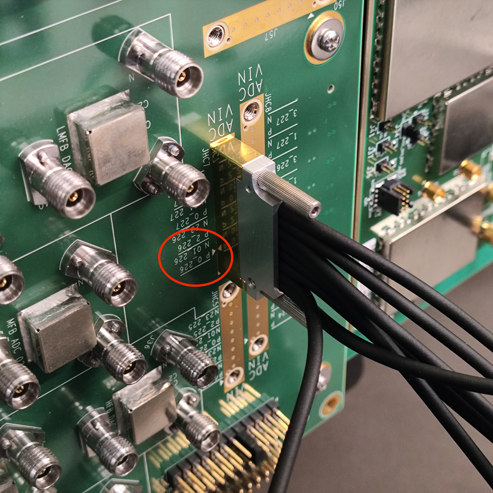
  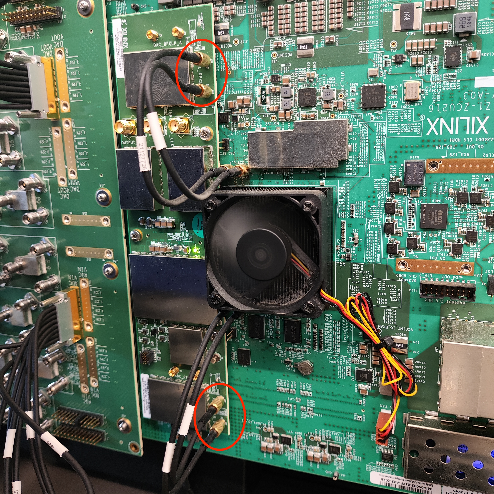
</p>

## Citation

TBD